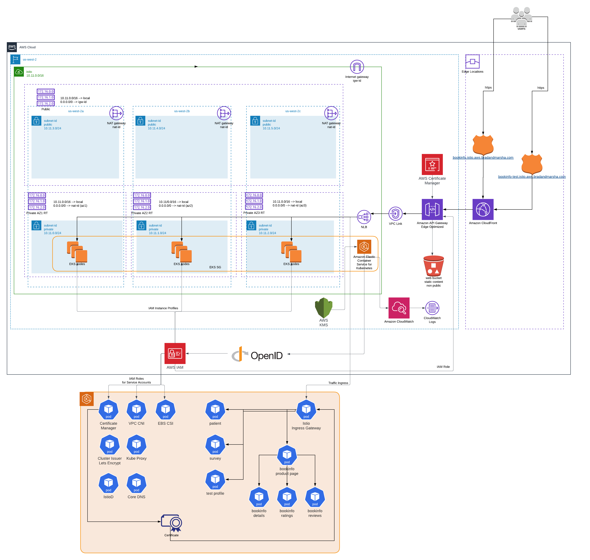

# myistioapigateway
A sandbox EKS cluster with istio, cert-manager, and bookinfo deployed and fronted by an AWS API Gateway

## Deployment order
1.  Terraform apply tf sub-directory
2.  kubectl apply all resources in k8s sub-directory
3.  Terraform apply tf/api sub-directory

## direct to NLB DNS
`curl http://a9ab74a5163e94daaacf47dd24e7c72f-9b64cb6a607fd1f1.elb.us-west-2.amazonaws.com/productpage`

## For HTTPs, use domain name in curl request and resolve to one of the NLB's ip addresses
## dig internal NLB DNS name for IPs to use in resolve below
`curl https://bookinfo.istio.aws.bradandmarsha.com/productpage --resolve 'bookinfo.istio.aws.bradandmarsha.com:443:10.11.1.241'`
